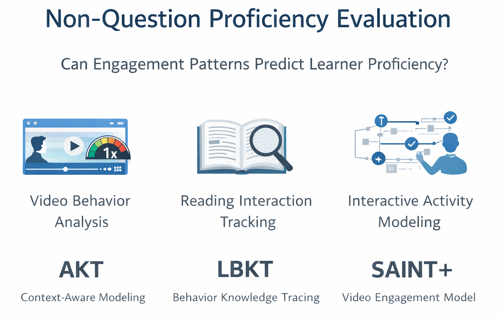

<!-- <h1 align="center">Non-Question Proficiency Evaluation</h1>
 -->

  

## Table of Contents

- [1. Problem Statement](#1-problem-statement)
- [2. Approach](#2-approach)
- [3. Model Selection Rationale](#3-model-selection-rationale)
- [4. Implementations](#4-implementations)
  - [4.1. Interactive Content - AKT](#41-interactive-content---akt)
  - [4.2. Reading Content - LBKT](#42-reading-content---lbkt)
  - [4.3. Video Content - SAINT+](#43-video-content---saint)
- [5. Technical Considerations](#5-technical-considerations)

## 1. Problem Statement

This organization addresses the core challenge of **estimating learner proficiency from non-assessment engagement data**. Traditional proficiency evaluation relies on direct assessment through questions and exercises. This project explores whether we can infer learner proficiency from indirect signals such as:

- Video watching behaviors (pauses, rewinds, playback speed)
- Reading interactions (scroll depth, time spent, reading speed)
- Interactive content engagement (action sequences, completion patterns)

The fundamental question is: **Can engagement patterns serve as valid proxies for learning proficiency when direct assessment data is unavailable?**

## 2. Approach

This project addresses proficiency estimation as a **machine learning prediction problem**, leveraging state-of-the-art Knowledge Tracing (KT) models trained on behavioral engagement signals. Rather than applying a one-size-fits-all solution, we employ **content-specific modeling strategies** that align with the unique characteristics of each learning modality.

Our approach recognizes that different content types generate fundamentally different behavioral signals, each requiring specialized model architectures:

- **Video content** generates temporal engagement patterns where duration, pauses, and playback speed reflect cognitive load and comprehension
- **Reading content** produces multi-dimensional behaviors (reading pace, re-reads, highlights) that indicate knowledge acquisition and retention
- **Interactive content** creates action sequences where recency and difficulty interactions reveal current proficiency state

Each model is grounded in established educational psychology and psychometric theory, ensuring that our proficiency estimates are theoretically sound and interpretable. The models produce probabilistic proficiency estimates that serve as **complementary evidence** to traditional assessment methods, providing insights when direct assessment data is unavailable or impractical.

## 3. Model Selection Rationale

The selection of each Knowledge Tracing model for its respective content type is based on theoretical alignment between the model's architecture and the behavioral characteristics of the learning modality. The following table summarizes the rationale behind each pairing:

| Content Type | Knowledge Tracing Model | Justification |
|--------------|------------------------|--------------|
| **Video** | **SAINT+** | Native temporal embeddings (`elapsed_time`, `lag_time`) map directly to watch duration and session gaps. Transformer encoder-decoder architecture handles sequential video consumption patterns effectively, capturing both exercise context and response patterns in separate representational spaces. |
| **Reading** | **LBKT** | The three-behavior architecture (speed → reading pace, attempts → re-reads, hints → highlights) provides a near-perfect semantic match to reading engagement patterns. No need to force-fit features—the model's behavioral channels align naturally with reading behaviors. |
| **Interactive** | **AKT** | Monotonic attention with exponential decay is ideal for simulations where recent actions matter most for predicting current proficiency. Rasch-based difficulty embeddings work well for modeling action complexity and ability-difficulty interactions. |

## 4. Implementations

Three specialized implementations have been developed, each targeting a specific content type and grounded in established theoretical frameworks:

### 4.1. Interactive Content - AKT

**Directory**: `Interactive-Proficiency-AKT`

**Context-Aware Attentive Knowledge Tracing (AKT)** models learner proficiency from interactive engagement sequences by combining insights from Item Response Theory (IRT) and cognitive science. AKT addresses two critical limitations of traditional knowledge tracing models.

**Theoretical Foundation**:

AKT is motivated by two key insights from psychometrics and cognitive science. First, drawing from **Item Response Theory (IRT)**, specifically the Rasch model, AKT recognizes that a learner's probability of success depends on the difference between their ability and the question's difficulty. Unlike traditional models that treat questions as atomic units, AKT decomposes question representations into concept embeddings plus difficulty scalars: `x_q = c_k + μ_q · d_k`. This allows the model to understand that different questions can test the same underlying knowledge at varying difficulty levels, enabling more nuanced proficiency estimation.

Second, AKT implements **monotonic attention with exponential decay**, motivated by memory research showing that recent experiences are more diagnostic of current knowledge state than distant ones. Attention weights are multiplied by `exp(-λ · Δt)`, where `Δt` is the time gap between interactions. This encodes the principle that a correct answer from 5 minutes ago provides stronger evidence of current knowledge than the same answer from 5 months ago, accounting for potential forgetting.

**Architecture**:

AKT employs a three-module context-aware architecture:
- **Knowledge Encoder**: Contextualizes the response history to understand what the learner has demonstrated
- **Question Encoder**: Contextualizes the exercise sequence to capture how questions relate to each other
- **Knowledge Retriever**: Uses decayed attention to selectively retrieve relevant historical knowledge for predicting current performance

This separation allows the model to independently learn representations for "what was practiced," "how performance evolved," and "what's relevant now," making AKT particularly well-suited for interactive simulations, games, and adaptive testing scenarios where recency strongly predicts current state.

**Key Features**:
- Rasch-inspired embeddings that separate concept knowledge from question difficulty
- Monotonic attention with exponential decay for temporal relevance weighting
- Context-aware three-module architecture (knowledge encoder, question encoder, knowledge retriever)
- Supports both Rasch and Non-Rasch model variants

### 4.2. Reading Content - LBKT

**Directory**: `Reading-Proficiency-LBKT`

**Learning Behavior-oriented Knowledge Tracing (LBKT)** tracks knowledge states from reading behaviors by operationalizing a fundamental principle from educational psychology: **how you learn matters as much as whether you learn**. Unlike traditional models that treat all correct answers as equivalent evidence of knowledge, LBKT recognizes that learning outcomes depend critically on the behaviors exhibited during learning.

**Theoretical Foundation**:

LBKT is grounded in **behavioral learning theory** and decades of learning science research showing that different learning behaviors produce fundamentally different learning outcomes. A student who answers correctly after 5 attempts and 3 hints has demonstrated different learning than one who answered correctly in 2 seconds with no assistance. LBKT operationalizes this through three behavior channels derived from Intelligent Tutoring Systems research:

- **Speed**: Normalized response time, capturing fluency and automaticity
- **Attempts**: Retry count, capturing productive struggle versus guessing
- **Hints**: Help-seeking behavior, capturing metacognitive awareness and scaffolded learning

**Architecture**:

LBKT employs a two-module architecture for behavior processing:

1. **DBEQ (Differentiated Behavior Effect Quantifying) Module**: Embodies the principle that each behavior has an independent, quantifiable effect on knowledge acquisition. Fast correct answers contribute more to durable learning than slow hint-assisted answers, formalized through separate neural pathways that weight each behavior's contribution to knowledge gain.

2. **FBEM (Fused Behavior Effect Measuring) Module**: Captures the theoretical insight that behaviors interact non-additively. Fast speed combined with no hints signals confident mastery, but fast speed combined with many attempts signals trial-and-error guessing—the same speed value means different things in different behavioral contexts. FBEM uses cross-attention between behavior channels to capture these interaction effects, learning a behavioral "grammar" of learning patterns.

3. **Behavior-Aware Forgetting Gate**: Implements the principle from memory research that encoding strength predicts retention. Knowledge acquired through effortful, deliberate practice (slow, engaged) decays more slowly than knowledge acquired superficially (fast, hint-dependent), mirroring the **desirable difficulties framework** in learning science.

**Key Features**:
- Three-behavior architecture (Speed, Attempts, Hints) aligned with reading engagement patterns
- Differentiated Behavior Effect Quantifying (DBEQ) module for independent behavior effects
- Fused Behavior Effect Measuring (FBEM) module for behavior interaction modeling
- Behavior-aware forgetting gate that accounts for encoding strength in retention

### 4.3. Video Content - SAINT+

**Directory**: `Video-Proficiency-SAINT`

**SAINT+ (Separated Self-Attentive Neural Knowledge Tracing Plus)** is a Transformer-based knowledge tracing model adapted for video engagement data, built on a fundamental theoretical premise borrowed from sequence-to-sequence modeling in NLP: input context and output generation benefit from separate representational spaces before being unified.

**Theoretical Foundation**:

Traditional knowledge tracing models like DKT concatenate exercise-response pairs into a single sequence, forcing the model to simultaneously learn "what the exercise is" and "how the student performed"—two semantically different types of information. SAINT+ resolves this by employing a **transformer encoder** that builds rich, contextualized representations of the exercise sequence (capturing relationships like "exercise 3 is a prerequisite for exercise 7"), while a **separate decoder** processes the response sequence and attends to the encoder's output through cross-attention, effectively asking "given what I know about these exercises and how the student responded to previous ones, what is their knowledge state?"

The theoretical extension from SAINT to SAINT+ addresses a critical limitation in educational modeling: **time is information**. Drawing from educational psychology research showing that response time correlates with cognitive load, confidence, and mastery, SAINT+ introduces **continuous temporal embeddings** for `elapsed_time` (time-on-task) and `lag_time` (spacing between practice sessions). These are not discretized into buckets but projected through learned linear transformations, preserving the continuous nature of time and allowing the model to learn nuanced patterns like "5 minutes on a 2-minute problem suggests struggle, while 30 seconds suggests either mastery or guessing."

This temporal awareness makes SAINT+ theoretically well-suited for any learning modality where engagement duration carries signal—video watching, reading, or problem-solving—and is grounded in **cognitive load theory**, which posits that time-on-task reflects the cognitive effort invested in learning.

**Architecture**:

- **Encoder**: Processes exercise sequences with self-attention, building contextualized representations
- **Decoder**: Processes response sequences and attends to encoder outputs via cross-attention
- **Temporal Embeddings**: Continuous representations of `elapsed_time` and `lag_time` integrated throughout the model
- **Causal Masking**: Prevents future data leakage, ensuring predictions depend only on past interactions

**Key Features**:
- Transformer-based architecture with separate encoder-decoder spaces
- Continuous temporal embeddings (`elapsed_time`, `lag_time`) preserving time's continuous nature
- Cross-attention mechanism linking exercise context to response patterns
- Causal masking to prevent future data leakage
- Cross-validation AUC: 0.799

## 5. Technical Considerations

When deploying these models in production, several important considerations should be kept in mind:

- **Probabilistic Nature**: Proficiency estimates from engagement data are inherently probabilistic and should be treated as **complementary evidence** rather than definitive assessments. Validation against direct assessment data is recommended when available.

- **Content-Specific Modeling**: Each content type requires specialized modeling approaches due to fundamentally different behavioral signal characteristics. A model optimized for video engagement will not perform well on reading behaviors, and vice versa.

- **Temporal Dynamics**: All models account for knowledge acquisition, retention, and decay over time, but they do so through different mechanisms (exponential decay in AKT, behavior-aware forgetting in LBKT, temporal embeddings in SAINT+). Understanding these mechanisms is crucial for proper interpretation of results.

- **Sequence Processing**: All implementations process engagement as temporal sequences to capture learning progression. This means that the order and timing of interactions matter—the same set of interactions in a different sequence may produce different proficiency estimates.

- **Theoretical Grounding**: Each model is grounded in established educational psychology and psychometric theory, ensuring that proficiency estimates are theoretically sound and interpretable. This theoretical foundation distinguishes our approach from purely data-driven methods that may lack interpretability.
